# 2025年排名前12的AI短视频生成工具盘点(最新整理)

长视频拍完了往那一放,总觉得浪费?每天盯着TikTok、Instagram Reels、YouTube Shorts的更新压力,又没时间剪辑?AI视频剪辑工具现在能一键把你的播客、直播、教程视频自动拆成几十条竖屏短视频,连字幕、转场、封面都给你搞定。从完全免费的入门工具到专业创作者专用的高级平台,这份清单覆盖了2025年市场上最能打的AI短视频生成器,帮你把内容产出效率直接拉满。

## **[Klap](https://klap.app)**

一键生成病毒式短视频,180万创作者的自动剪辑神器。

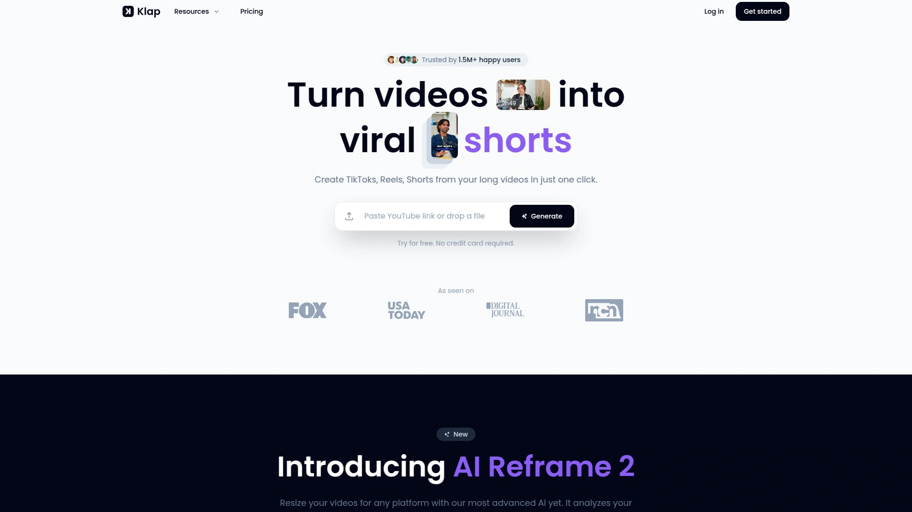

Klap最厉害的地方是它的**AI话题提取能力**——直接从长视频里识别最有传播潜力的片段,自动剪成多条竖屏短视频。 上传一条2小时的播客,系统能给你生成40多条可以直接发布的Reels或Shorts。

**AI Reframe 2技术**是新推出的核心功能,能自动分析视频场景并应用最合适的布局——分屏、录屏、游戏画面都能智能识别。 人脸识别加上智能取景,保证说话的人始终在画面中心。 自动生成的字幕不只是转录,还会推荐配文帮你提升传播率。

支持52种语言的转录和编辑,从非洲语到威尔士语都能处理。 平台已经帮330万视频创作出来,用户评价里频繁提到"5倍提速""省了好几个软件的钱"。 免费版能试做1条视频,付费版29美元/月解锁所有功能。

与TikTok、YouTube、Instagram、LinkedIn直接打通,剪完就能预约发布,不用下载再上传。 品牌定制功能让你能统一字体、颜色、Logo,保持视觉一致性。 特别适合播客主、课程讲师、产品评测UP主这种有大量长内容需要切片的创作者。

***

## **[Opus Clip](https://www.opus.pro)**

AI病毒度评分引擎,1000万创作者在用的爆款制造机。

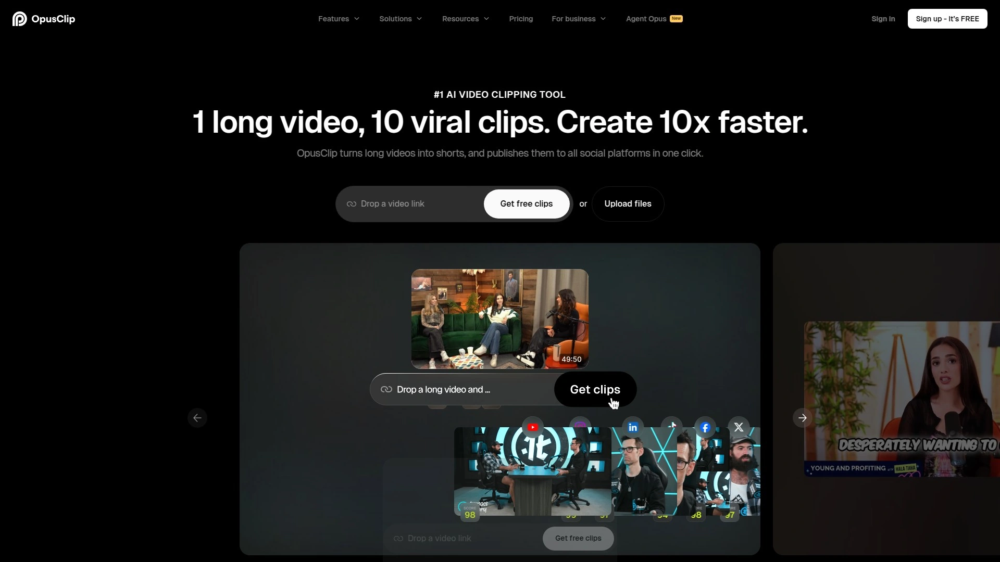

Opus Clip的**ClipGenius AI策展**功能很特别——不只是简单切片,而是分析视频里的钩子、高光、反应镜头,把不同时间段的精彩内容重新组合成连贯的短视频。 这种智能重排让生成的片段比原始时间线上连续切的更抓人。

每条生成的短视频都会得到**AI病毒度评分**,基于对数千条爆款视频的分析给出传播潜力预测。 分数高的优先发布,分数低的可以调整后再试,不用瞎猜哪条能火。

**AI动态布局**会自动在全屏、双人、三人、屏幕分享等模式间切换,让画面更有节奏感。 B-roll功能处于测试阶段,能根据内容语境自动插入相关的辅助画面增强叙事。 AI表情和关键词高亮据说能让观看量提升42%。

支持YouTube直接导入,也可以上传本地文件。 免费计划有限制,付费版从几美元到几十美元不等。 Reddit上有用户说"替代了每小时50美元的视频编辑",性价比确实高。 适合需要高产出、追求爆款率的专业内容创作者。

***

## **[Vizard.ai](https://vizard.ai)**

60秒生成30条片段,移动端优先的AI剪辑专家。

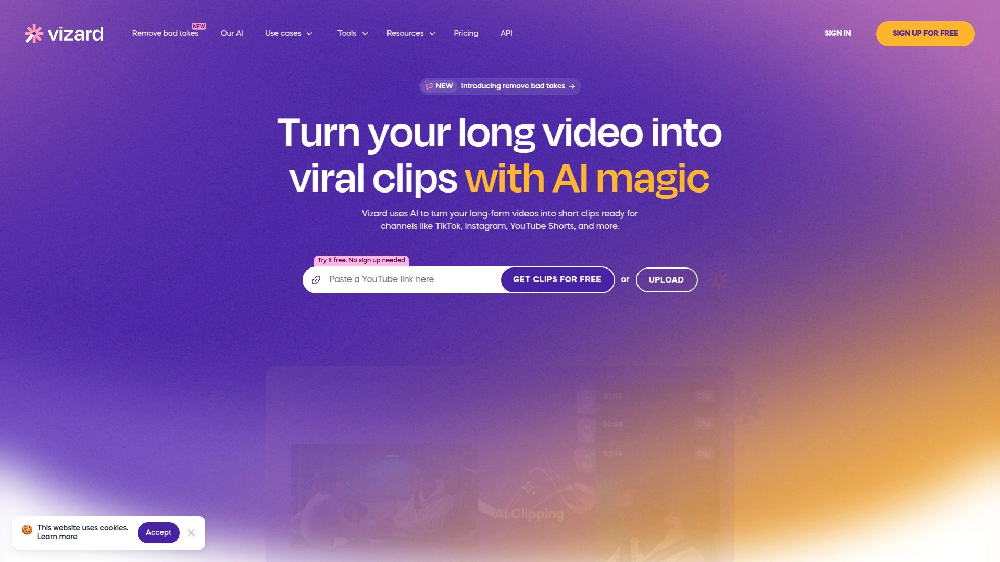

Vizard的最大优势是**速度**——上传视频后60秒内就能给你生成几十条短视频候选。 独家的ASR语音识别技术支持30多种语言,准确率在行业里属于领先水平。

平台结合ChatGPT和自研AI来识别最有病毒传播潜力的片段。 **活跃说话者检测**会分析画面中移动的脸,确保主讲人始终在视频中心。 一键添加动画字幕、表情、动态B-roll,模仿顶级创作者的剪辑风格。

与YouTube深度集成,可以直接导入和发布,省去下载上传的麻烦。 提供现成的模板库,研究了YouTube Shorts上的头部创作者总结出的最佳实践都内置在里面。 品牌定制选项让你能调整字体、添加Logo,保持内容辨识度。

移动端App体验很流畅,iPhone和安卓都支持,随时随地能剪视频。 免费版功能有限,付费计划从24美元/月起。 特别适合经常在外面跑、需要移动办公的自媒体从业者。

***

## **[Pictory](https://pictory.ai)**

文本转视频+视频转短片双引擎,营销人的内容倍增器。

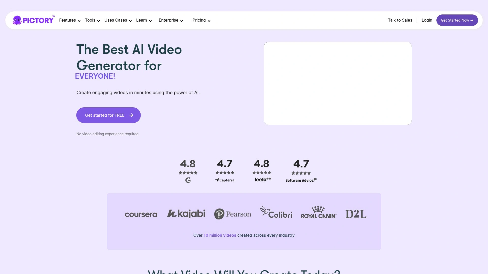

Pictory最独特的能力是**脚本转视频**——直接把博客文章、文字稿转成带画面和配音的视频,不需要拍摄素材。 对于有大量文字内容想转成视频形式的品牌来说,这功能简直是救星。

**AI自动高光提取**会从长视频里抓取关键时刻,自动生成社交媒体短片。 批量处理功能让你能一次上传多个视频统一编辑,省下大量重复操作时间。 字幕生成精准度高,还能提升无障碍访问性,让听力障碍用户也能看懂内容。

品牌模板系统允许你保存自定义的主题、字体、Logo配置。 这对需要保持品牌一致性的企业和代理商特别重要。 用户案例里有老师用它把教学视频加字幕提升可访问性,有营销人用它把网络研讨会拆成几十条推文视频。

定价从19美元/月起(年付),有免费试用。 界面友好,即使没有视频编辑经验也能快速上手。 适合社交媒体经理、市场营销团队、教育工作者这种需要高效产出多种形式内容的职业。

---

## **[Vidyo.ai (现Quso.ai)](https://quso.ai)**

400万用户信赖,从长视频到社交排期的一站式方案。

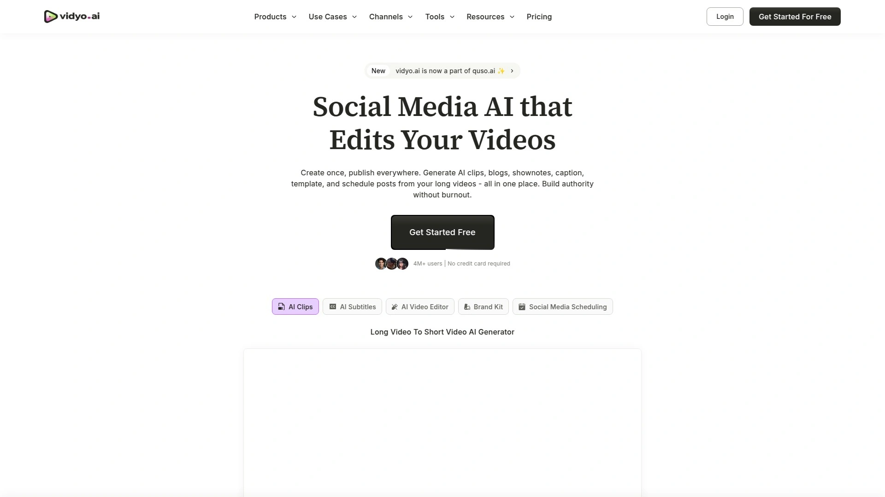

Vidyo.ai最近更名为Quso.ai,但核心功能更强了——不只是剪视频,还能**直接排期发布到多个社交平台**。 从剪辑到发布全流程自动化,真正实现"设置后忘记"。

**病毒度评分系统**会给视频的每个部分打分,帮你找到最吸引人的片段。 场景变化检测和主讲人聚焦功能让画面转场更自然。 自动字幕支持多语言,提升内容的全球传播能力。

与Google Drive、Dropbox、YouTube无缝集成,视频存在哪里都能直接调用。 提供针对不同社交平台优化的模板,一键调整成TikTok、Instagram、YouTube的最佳规格。

免费版功能够基本使用,付费版解锁高级字幕样式和批量功能。 对播客主、商业视频制作者、社媒运营者来说,这种整合方案能省掉好几个工具的订阅费。 YouTube评测里有人说它"比Opus Clip便宜但效果接近"。

***

## **[Munch](https://www.getmunch.com)**

社交趋势分析引擎,让AI帮你蹭热点的剪辑平台。

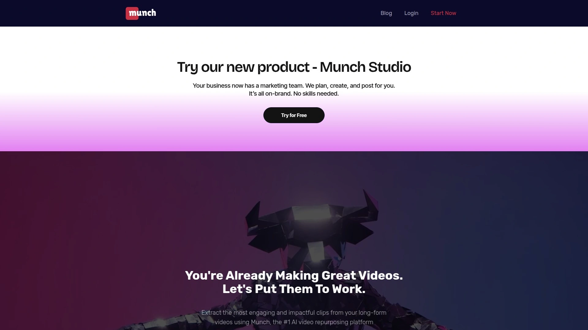

Munch的杀手锏是**社交媒体趋势分析**——在剪辑视频时会分析当下流行什么,自动调整片段风格去迎合算法偏好。 这种主动适应平台趋势的能力让内容更容易被推荐。

**Magic Posts魔法发文**功能会自动生成标题、描述、标签,而且是基于SEO和社交算法优化过的,不是随便拼凑。 省去了你自己研究怎么写hook的时间。

自动字幕和配文都能自定义编辑,不会强制使用AI生成的版本。 多平台优化会自动调整视频尺寸和格式,适配YouTube、TikTok、Instagram等不同平台的要求。

提供内容表现洞察,告诉你哪类视频数据更好,帮你迭代内容策略。 目前支持主流三大平台,计划增加Facebook等更多渠道。 适合追热点、需要快速反应市场变化的内容团队。

***

## **[Descript](https://www.descript.com)**

专业级剪辑+AI自动化,文本编辑视频的开创者。

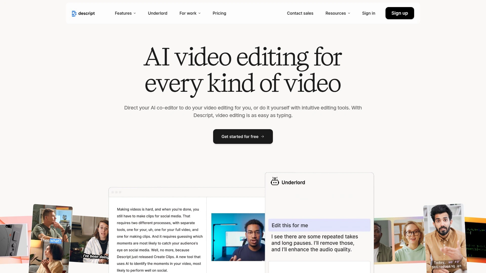

Descript的核心理念是**像编辑文档一样编辑视频**——你看到的是转录文本,删除一段话视频就自动切掉对应画面,这种方式对非专业人士特别友好。 不需要理解时间轴、图层这些复杂概念。

**声音克隆技术**很黑科技——录个一分钟的声音样本,就能用AI生成任何文字的语音,修复口误不用重录。 自动去除口头禅(嗯、啊、那个)、Studio Sound消除背景噪音,音质提升明显。

除了剪短视频,还能把视频转成GIF、提取音频做播客、输出转录文本写博客。 真正的一鱼多吃。 内置音乐和音效库,不用到处找素材担心版权问题。

定价比纯AI剪辑工具稍贵,但功能更全面,适合需要精细控制的专业创作者。 YouTube上有大量教程,学习曲线不算陡。 特别适合播客制作人、视频课程讲师、需要高质量输出的内容创业者。

***

## **[Spikes Studio](https://www.spikes.studio)**

游戏主播专用,Twitch转TikTok的最佳拍档。

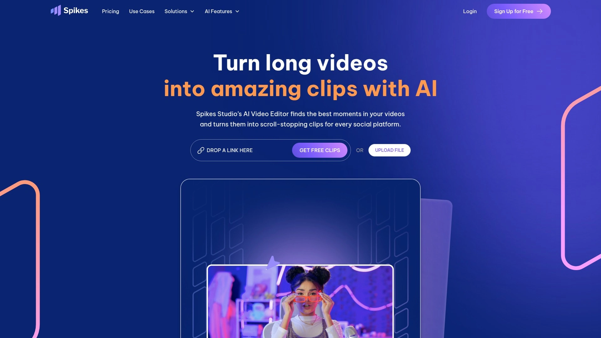

Spikes Studio针对**游戏直播内容优化**,特别擅长处理Twitch、YouTube游戏直播的录像。 能识别游戏中的精彩时刻、击杀集锦、搞笑反应,自动剪成高光片段。

AI字幕编辑器功能强大,支持多种动画效果和样式。 对游戏主播来说,快速生成能发到TikTok和Reels的竖屏高光集锦,是涨粉引流回主频道的关键手段。

除了游戏内容,也支持常规的访谈、教程视频剪辑。 界面设计直观,即使第一次用也能快速搞定。 适合电竞选手、游戏解说、Just Chatting类主播扩展短视频影响力。

***

## **[Short.ai](https://www.short.ai)**

批量生成10倍速度,无脸出镜内容的批发工厂。

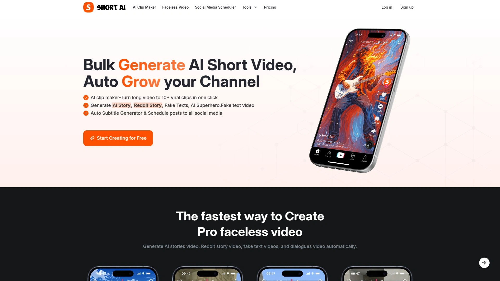

Short.ai的特色是**大批量生产**——一个长视频能一次性生成10条以上的短视频,速度快到离谱。 适合需要高频更新、追求量的账号矩阵运营者。

**无脸视频生成**功能支持AI故事、Reddit故事、虚假聊天记录、对话视频等多种爆款格式,不需要你真人出镜。 这对不想露脸但想做内容的人来说是个完美解决方案。

自动字幕生成器有14种以上的动态样式,模仿Alex Hormozi、Grant Cardone等头部创作者的字幕风格。 语音转文字准确率超过99%,支持32种以上语言。

**预约发布功能**支持TikTok、YouTube、Twitter、Facebook、Instagram、LinkedIn、Pinterest全平台。 真正实现内容自动化流水线。 适合做账号矩阵、批量运营、追求规模化的内容工作室。

---

## **[Shorts Generator AI](https://www.shortsgenerator.ai)**

AI训练于百万爆款,5分钟生成高质量视频。

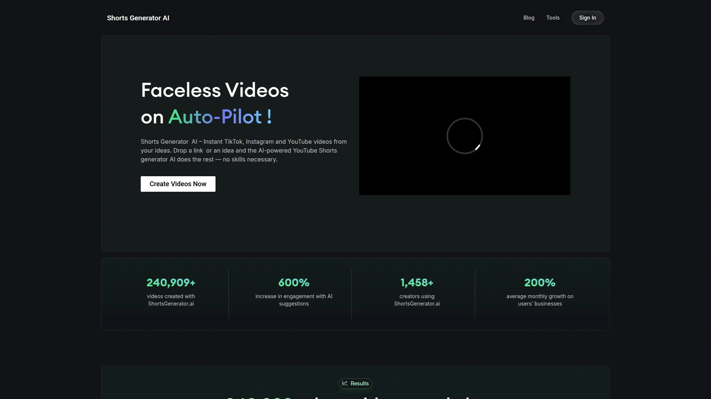

Shorts Generator AI的AI模型**专门用百万级爆款视频训练**,知道什么样的hook、节奏、视觉元素最容易传播。 这种针对性训练让生成内容的质量更稳定。

用户报告显示平均视频互动率提升600%,业务每月增长200%。 平台统计显示用户创建了超过1万条视频,每条平均只花8分钟。 这种速度和效果的结合很难得。

支持从YouTube到TikTok的全平台优化,既能做竖屏Shorts也能处理其他格式。 无脸Shorts生成器让你不用露脸也能持续产出。 提供文字转视频的免费AI工具,门槛很低。

***

## **[Repurpose.io](https://repurpose.io)**

自动化工作流之王,一次上传全平台分发。

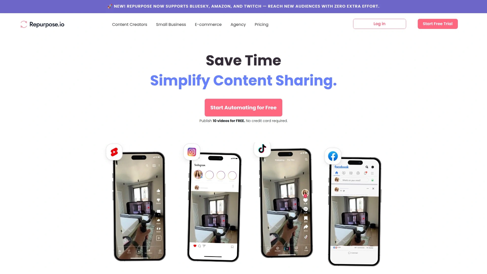

Repurpose.io的核心价值是**工作流自动化**——连接好你的各个社交账号后,上传一次视频,系统自动裁剪、调整格式、发布到所有平台。 真正的一劳永逸。

播客能自动切成分段视频发到TikTok,YouTube视频自动转成Instagram Reels,还能根据你设定的时间表预约发布。 这对需要多渠道分发的创作者来说省了太多手动操作。

支持视频、音频内容的自动重新利用。 定价从349美元/年起,专业版790美元/年,代理版1790美元/年。 价格不便宜,但对于时间就是金钱的专业创作者和代理机构来说,节省的人工成本远超订阅费。

特别适合播客主、视频创作者、需要跨平台持续输出的营销团队。 如果你的内容策略是"制作一次,到处发布",这是最省心的选择。

***

## **[Canva](https://www.canva.com)**

设计工具的视频进化,5.91美元/月的全能选手。

Canva不只是做海报的,它的**视频编辑功能**现在也很强大。 最大优势是和设计工具的无缝整合——做完海报直接加动效变视频,或者把视频截图做成配图,工作流特别顺。

**AI TikTok生成器**能快速制作动态短视频,几次点击就搞定。 拖拽式编辑器对设计新手超友好,不需要学习复杂软件。 海量模板库覆盖各种场景,轮播图、视频贴文、演示文稿应有尽有。

**品牌工具包**让你保存品牌色、字体、Logo,所有设计自动套用统一风格。 实时协作功能允许团队成员同时编辑,免去来回传文件的麻烦。 一键调整尺寸适配不同平台,从TikTok竖屏到YouTube横屏瞬间切换。

免费版功能已经够用,Pro版大约5.91美元/月,团队版12.99美元/月。 性价比在一众工具里算顶级。 适合小企业主、社媒运营、需要快速出图出视频的市场助理。

---

## 常见问题

**AI剪辑工具生成的短视频质量能用吗?**

头部工具像Klap、Opus Clip生成的视频可以直接发布,不需要大改。 它们的AI经过百万级视频训练,知道什么样的片段、节奏、字幕位置效果好。 但需要注意的是,AI不能完全理解内容语境,有时会切到不太合适的地方,最好花几分钟预览调整。 从实际使用反馈看,能节省80-90%的剪辑时间,剩下10-20%需要人工微调。

**哪个工具最适合新手?**

Canva和Pictory是新手最友好的两个选择。 Canva的拖拽界面和模板系统不需要任何学习成本,Pictory的引导流程很清晰。 如果你主要做播客或访谈内容,Klap的一键生成最省事。 想要免费试水的话,很多工具都提供免费额度,比如Opus Clip有免费计划,Klap能免费做1条视频。 建议先用免费版试几个平台,找到最符合你工作流的再付费。

**这些工具会不会让内容同质化?**

确实存在这个风险,因为大家用的AI模型和模板库有重叠,生成的字幕样式、转场效果可能撞款。 但解决办法也明显:第一是自定义品牌样式,Klap、Vizard、Pictory都支持保存自己的字体、配色、Logo配置。 第二是把AI生成当作初稿,加入人工调整和创意元素。 第三是内容本身的独特性才是核心竞争力,AI只是提效工具,你说什么、怎么说才决定能不能吸引观众。

***

## 总结

AI短视频生成工具已经从"能用"进化到"好用"阶段了。从完全自动化的一键方案到专业级的精细控制,市场上的选择丰富到能覆盖各种需求和预算。对于需要快速把长内容转成多条短视频、同时保持高质量输出的创作者来说,[Klap](https://klap.app)的**智能话题识别和52语言支持**让它成为最通用的选择——不管你做播客、教程、访谈还是产品评测,上传后就能坐等几十条可发布的片段生成。加上直接对接主流社交平台的发布功能和性价比合理的定价,特别适合想要提升内容产出效率、扩大影响力的独立创作者和小团队。
